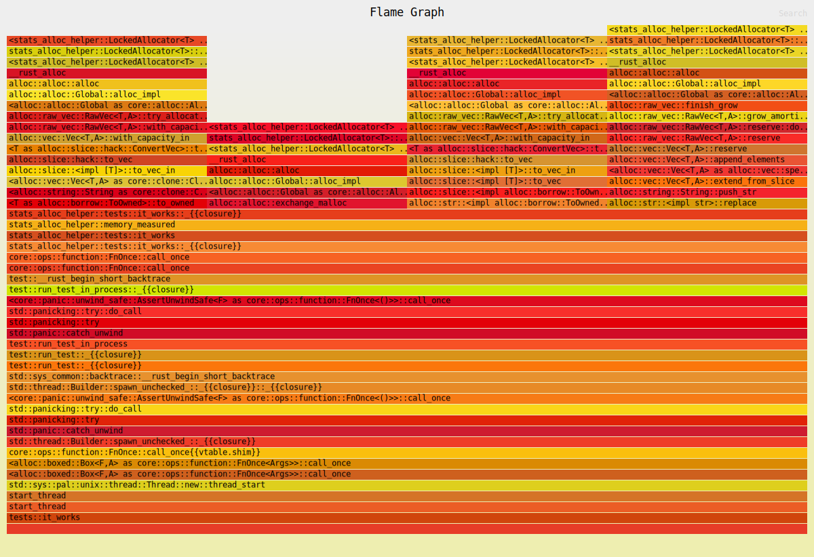

# `stats_alloc_helper`

A crate that provides a helper to measure memory allocations in tests.

## Example

To allow measuring allocations, you must use the provided `LockedAllocator`,
because otherwise tests running in other thread could mess up the numbers.

### Synchronous code

Typically this means a setup similar to the following in tests:

```rust
use std::alloc::System;
use stats_alloc::{StatsAlloc, Stats};
use stats_alloc_helper::{LockedAllocator, memory_measured};

#[global_allocator]
static GLOBAL: LockedAllocator<System> = LockedAllocator::new(StatsAlloc::system());

// In the actual tests:

let mut length = 0;

let stats = memory_measured(&GLOBAL, || {
    let s = "whoa".to_owned().replace("whoa", "wow").to_owned();

    length = s.len();
});

assert_eq!(length, 3);

assert_eq!(
    stats,
    Stats {
        allocations: 3,
        deallocations: 3,
        reallocations: 0,
        bytes_allocated: 15,
        bytes_deallocated: 15,
        bytes_reallocated: 0
    }
);
```

### Async code

Async futures are supported with `async_tokio` feature enabled:

```rust,ignore
#[tokio::test]
async fn test_tokio() {
    let stats = memory_measured_future(&GLOBAL, async {
        let _ = vec![1, 2, 3, 4];
    })
    .await;

    assert_eq!(
        stats,
        Stats {
            allocations: 1,
            deallocations: 1,
            reallocations: 0,
            bytes_allocated: 16,
            bytes_deallocated: 16,
            bytes_reallocated: 0
        }
    );
}
```

This is achieved by creating a separate single threaded runtime
on a separate thread and driving the future to completion on it.

<div class="warning">
<!-- the next empty line is necessary for docs.rs -->

Keep in mind that your future must be able to be driven to completion on a
separate runtime with no dependencies on the main one.

If you create a complex client on the main runtime (think `hyper`) and try
to test one method of it on a separate runtime, you might discover a deadlock
because there's a background future being driven by the main runtime that
is blocked trying to access a locked allocator.

You can solve this by:

1. Measure how much memory it takes to create a client.
2. Measure how much memory it takes to create a client and do a thing.
3. Subtract the former from the latter.
</div>

### USDT probes and flamegraphs

This crates adds USDT probes for locked allocations as well:

* `LockedAllocator:alloc_locked`
* `LockedAllocator:dealloc_locked`
* `LockedAllocator:realloc_locked`

To see allocations from a particular test, one can use `perf`:

1. Compile the tests and note the binary produced:

```text
$ cargo test --no-run
   Compiling stats_alloc_helper v0.3.0 (/home/ivan/projects/stats_alloc_helper)
    Finished `test` profile [unoptimized + debuginfo] target(s) in 5.09s
  Executable unittests src/lib.rs (target/debug/deps/stats_alloc_helper-9847447b1d1ec0c4)
```

2. Add the probes for allocations for the binary above:

```text
$ sudo perf probe -x ./target/debug/deps/stats_alloc_helper-9847447b1d1ec0c4 --add sdt_LockedAllocator:alloc_locked
Added new event:
  sdt_LockedAllocator:alloc_locked (on %alloc_locked in /home/ivan/projects/stats_alloc_helper/target/debug/deps/stats_alloc_helper-9847447b1d1ec0c4)

You can now use it in all perf tools, such as:

	perf record -e sdt_LockedAllocator:alloc_locked -aR sleep 1
```

3. Start collecting the data with `perf` in one terminal:

```text
$ sudo perf record -a -e sdt_LockedAllocator:alloc_locked -g --call-graph dwarf
```

4. Run the tests in another terminal:

```text
$ ./target/debug/deps/stats_alloc_helper-9847447b1d1ec0c4 -- --tests it_works

running 1 test
test tests::it_works ... ok

test result: ok. 1 passed; 0 failed; 0 ignored; 0 measured; 1 filtered out; finished in 0.01s
```

5. Stop perf with `ctrl`+`c` and run `perf script` to view events:

```text
$ sudo perf script
tests::it_works    7342 [002]  1331.303361: sdt_LockedAllocator:alloc_locked: (556e86e548)
	      556e86e548 _$LT$stats_alloc_helper..LockedAllocator$LT$T$GT$$u20$as$u20$core..alloc..global..GlobalAlloc$GT$::alloc::_$u7b$$u7b$closure$u7d$$u7d$::h6f705db76a45b45d+0x3c (/home/ivan/projects/stats_alloc_helper/target/debug/deps/stats_alloc_helper-9847447b1d1ec0c4)
	      556e86e2bb stats_alloc_helper::LockedAllocator<T>::serialized+0x7b (/home/ivan/projects/stats_alloc_helper/target/debug/deps/stats_alloc_helper-9847447b1d1ec0c4)
	      556e86e4ff <stats_alloc_helper::LockedAllocator<T> as core::alloc::global::GlobalAlloc>::alloc+0x33 (/home/ivan/projects/stats_alloc_helper/target/debug/deps/stats_alloc_helper-9847447b1d1ec0c4)
	      556e865f6f __rust_alloc+0x2b (/home/ivan/projects/stats_alloc_helper/target/debug/deps/stats_alloc_helper-9847447b1d1ec0c4)
	      556e865763 alloc::alloc::alloc+0x6f (/home/ivan/projects/stats_alloc_helper/target/debug/deps/stats_alloc_helper-9847447b1d1ec0c4)
	      556e86586f alloc::alloc::Global::alloc_impl+0xff (/home/ivan/projects/stats_alloc_helper/target/debug/deps/stats_alloc_helper-9847447b1d1ec0c4)
	      556e865f37 <alloc::alloc::Global as core::alloc::Allocator>::allocate+0x23 (/home/ivan/projects/stats_alloc_helper/target/debug/deps/stats_alloc_helper-9847447b1d1ec0c4)
	      556e86dc7b alloc::raw_vec::RawVec<T,A>::try_allocate_in+0x183 (/home/ivan/projects/stats_alloc_helper/target/debug/deps/stats_alloc_helper-9847447b1d1ec0c4)
	      556e868e27 alloc::raw_vec::RawVec<T,A>::with_capacity_in+0x3b (inlined)
	      556e868e27 alloc::vec::Vec<T,A>::with_capacity_in+0x3b (inlined)
	      556e868e27 <T as alloc::slice::hack::ConvertVec>::to_vec+0x3b (/home/ivan/projects/stats_alloc_helper/target/debug/deps/stats_alloc_helper-9847447b1d1ec0c4)
	      556e86496b alloc::slice::hack::to_vec+0x2b (inlined)
	      556e86496b alloc::slice::<impl [T]>::to_vec_in+0x2b (inlined)
	      556e86496b alloc::slice::<impl [T]>::to_vec+0x2b (inlined)
	      556e86496b alloc::slice::<impl alloc::borrow::ToOwned for [T]>::to_owned+0x2b (inlined)
	      556e86496b alloc::str::<impl alloc::borrow::ToOwned for str>::to_owned+0x2b (/home/ivan/projects/stats_alloc_helper/target/debug/deps/stats_alloc_helper-9847447b1d1ec0c4)
	      556e86f9cb stats_alloc_helper::tests::it_works::_$u7b$$u7b$closure$u7d$$u7d$::h064bc6e2ead5ac9c+0x27 (/home/ivan/projects/stats_alloc_helper/target/debug/deps/stats_alloc_helper-9847447b1d1ec0c4)
	      556e86e7eb stats_alloc_helper::memory_measured+0x6b (/home/ivan/projects/stats_alloc_helper/target/debug/deps/stats_alloc_helper-9847447b1d1ec0c4)
	      556e866083 stats_alloc_helper::tests::it_works+0x2b (/home/ivan/projects/stats_alloc_helper/target/debug/deps/stats_alloc_helper-9847447b1d1ec0c4)
	      556e86f98f stats_alloc_helper::tests::it_works::_$u7b$$u7b$closure$u7d$$u7d$::hb3e72c754a919576+0x13 (/home/ivan/projects/stats_alloc_helper/target/debug/deps/stats_alloc_helper-9847447b1d1ec0c4)
	      556e8665c3 core::ops::function::FnOnce::call_once+0xf (/home/ivan/projects/stats_alloc_helper/target/debug/deps/stats_alloc_helper-9847447b1d1ec0c4)
	      556e89d54b core::ops::function::FnOnce::call_once+0x13 (inlined)
	      556e89d54b test::__rust_begin_short_backtrace+0x13 (/home/ivan/projects/stats_alloc_helper/target/debug/deps/stats_alloc_helper-9847447b1d1ec0c4)
	      556e89cdfb test::run_test_in_process::_$u7b$$u7b$closure$u7d$$u7d$::h890e037ea78eb892+0x14f (inlined)
	      556e89cdfb <core::panic::unwind_safe::AssertUnwindSafe<F> as core::ops::function::FnOnce<()>>::call_once+0x14f (inlined)
	      556e89cdfb std::panicking::try::do_call+0x14f (inlined)
	      556e89cdfb std::panicking::try+0x14f (inlined)
	      556e89cdfb std::panic::catch_unwind+0x14f (inlined)
	      556e89cdfb test::run_test_in_process+0x14f (inlined)
	      556e89cdfb test::run_test::_$u7b$$u7b$closure$u7d$$u7d$::hd93cbd5460493157+0x14f (/home/ivan/projects/stats_alloc_helper/target/debug/deps/stats_alloc_helper-9847447b1d1ec0c4)
	      556e870057 test::run_test::_$u7b$$u7b$closure$u7d$$u7d$::h3980614fdc2390bb+0x93 (inlined)
	      556e870057 std::sys_common::backtrace::__rust_begin_short_backtrace+0x93 (/home/ivan/projects/stats_alloc_helper/target/debug/deps/stats_alloc_helper-9847447b1d1ec0c4)
	      556e8745db std::thread::Builder::spawn_unchecked_::_$u7b$$u7b$closure$u7d$$u7d$::_$u7b$$u7b$closure$u7d$$u7d$::h8a21f0157e97fbf6+0x8f (inlined)
	      556e8745db <core::panic::unwind_safe::AssertUnwindSafe<F> as core::ops::function::FnOnce<()>>::call_once+0x8f (inlined)
	      556e8745db std::panicking::try::do_call+0x8f (inlined)
	      556e8745db std::panicking::try+0x8f (inlined)
	      556e8745db std::panic::catch_unwind+0x8f (inlined)
	      556e8745db std::thread::Builder::spawn_unchecked_::_$u7b$$u7b$closure$u7d$$u7d$::h50d9109153134c66+0x8f (inlined)
	      556e8745db core::ops::function::FnOnce::call_once$u7b$$u7b$vtable.shim$u7d$$u7d$::hd9dcdfc921101872+0x8f (/home/ivan/projects/stats_alloc_helper/target/debug/deps/stats_alloc_helper-9847447b1d1ec0c4)
	      556e8c69e7 <alloc::boxed::Box<F,A> as core::ops::function::FnOnce<Args>>::call_once+0x2b (inlined)
	      556e8c69e7 <alloc::boxed::Box<F,A> as core::ops::function::FnOnce<Args>>::call_once+0x2b (inlined)
	      556e8c69e7 std::sys::pal::unix::thread::Thread::new::thread_start+0x2b (/home/ivan/projects/stats_alloc_helper/target/debug/deps/stats_alloc_helper-9847447b1d1ec0c4)
	      7fab6efe83 start_thread+0x383 (/usr/lib/aarch64-linux-gnu/libc.so.6)
	      7fab6efe83 start_thread+0x383 (/usr/lib/aarch64-linux-gnu/libc.so.6)

...
```

6. With a bit of ingenuity, you can turn this into a flamegraph:

```text
sudo perf script | sed 's/sdt_LockedAllocator:.*//' | inferno-collapse-perf | inferno-flamegraph --truncate-text-right > flamegraph.svg
```


